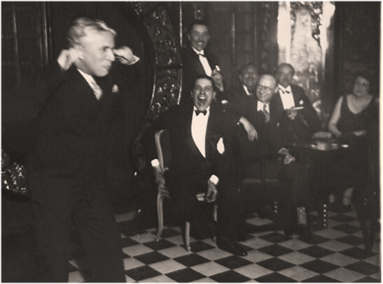

# 4.1 Lustiges

### 4.1 Lustiges

### 1 Das Äffchen - Chaplin tanzt Tango 

Im Jahr 1931 machte das Orchester von Julio de Caro eine Tour durch Europa, diesmal waren sie bei einer konzertanten Aufführung in Nizza; die Musik war nicht zum Tanzen gedacht. Das Konzert sollte eine halbe Stunde dauern, was schnell zu einer voller Stunde geworden ist. Gardel war anwesend und unter den vielen Prominenten von damals war auch Charlie Chaplin. Bei dem Stück von De Caros El monito (Das Äffchen) konnte sich Chaplin nicht mehr auf dem Sitz halten und begann zu tanzen, die Gäste fanden das eine gute Idee und rückten Tische und Stühle zur Seite und tanzten mit. Mit dem ‚Äffchen‘ ist der kleine Affe gemeint, den die Drehorgelspieler häufig dabei hatten. Im übrigen trugen diese Straßenmusiker dazu bei den Tango zu verbreiten, indem sie spielend durch verschiedene Bezirke von Buenos Aires zogen.

_El monito_, [Juilo Caros Sextett 1925](https://www.youtube.com/watch?v=0r5tjUC6rqg)

<figure><figcaption>
Chaplin und Gardel in Nizza ,1931
</figcaption></figure>

Zuletzt aktualisiert vor 1 Tag
